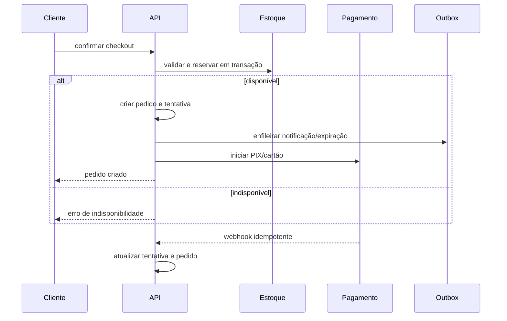

# Sequência de checkout

```mermaid
sequenceDiagram
  participant C as Cliente
  participant A as API
  participant I as Estoque
  participant P as Pagamento
  participant O as Outbox
  C->>A: confirmar checkout
  A->>I: validar e reservar em transação
  alt disponível
    A->>A: criar pedido e tentativa
    A->>O: enfileirar notificação/expiração
    A->>P: iniciar PIX/cartão
    A-->>C: pedido criado
  else indisponível
    A-->>C: erro de indisponibilidade
  end
  P-->>A: webhook idempotente
  A->>A: atualizar tentativa e pedido
```
